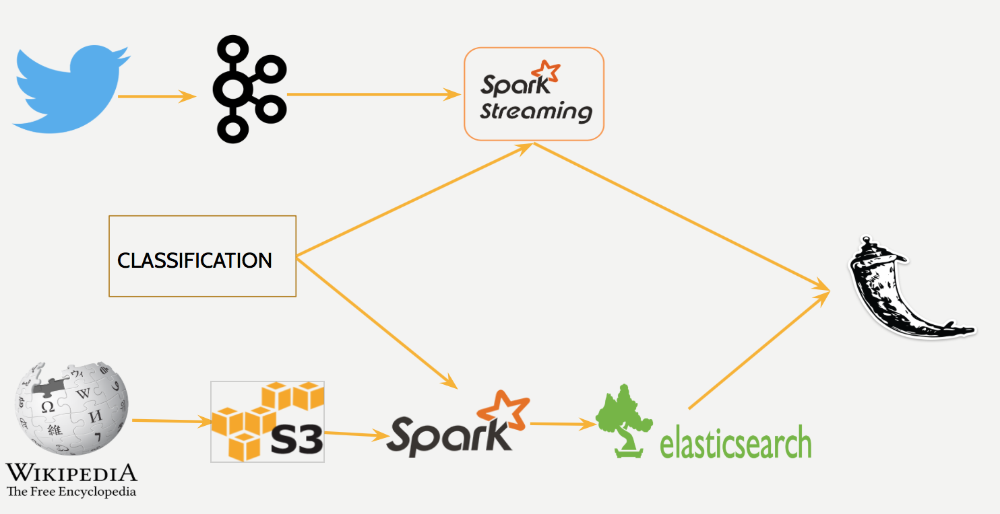

# Data Engineering Project at Insight

## TweetoPedia
### Table of Contents

1. [Overview](README.md#overview)
2. [Batch](README.md#batch)
3. [Streaming](README.md#streaming)
4. [Pipeline](README.md#pipeline)
5. [Repository Structure](README.md#repository-structure)

### Overview

TweetoPedia is a project developed as a part of my Data Engineering fellowship at Insight Data Science
This project is to help General Audience and Companies in the following way:

GENERAL AUDIENCE:
People are alwasy talking about something interesting in Twitter. You can definitely get whats trending but wouldn't it be more comfortable to get something in the sraea of your interest. And even if you get it what next. Its not necessary that you might have information on it.
For this purpose, My application TweetoPedia helps you to find current trending words in your area of interest i.e sports, business, entertainment, politics, technology.

COMPANIES:
What if companies could advertise on wikipedia pages. This application will help companies to find trending words in their domain and then find relevant wikipedia pages to advertise their content on.

To understand the working:
The Flask based UI helps a user to select the category of his choice. Once selected, the user is able to see a list of top 10 words which have been used the most in last 5 minutes. This list is uopdated dynamically. 
The user can then select a word from this list which he most interested in and can find appropriate Wikipedia Titles

The whole project had 2 aspects in implementation which are further discussed below

### Batch Processing
The batch portion covers getting wikipedia data from dumps and storing them to s3. This data is then retrieved using spark and using classification algorithm the documents re classsified into appropriate categories.
And these documents are then sored in Elasticsearch.

### Stream Processing
Tweets are ingested using Kafka through a Twitter API (Tweepy). Spark Streaming is then used to classify these Tweets into appropriate categories and then are sent to Flask API.

### Pipeline

[Project Slides](https://docs.google.com/presentation/d/1_coyhE1g0bii5ksxXF5ZrVSsFeIRwepHLKS6eXqR1iE/pub?start=false&loop=false&delayms=3000)

### Repository Structure

- `./Spark_Batch/` contains all relevant files for batch section of the project

- `./Kafka_Spark_Streaming/` contains the relevant files for the streaming section

